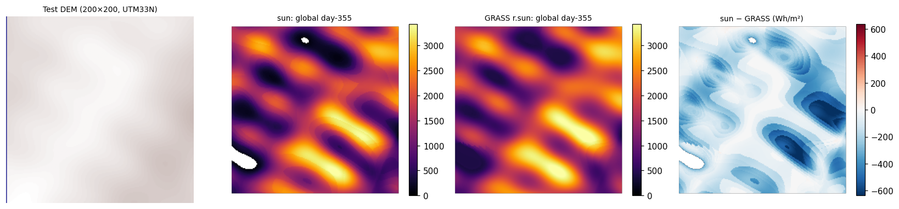
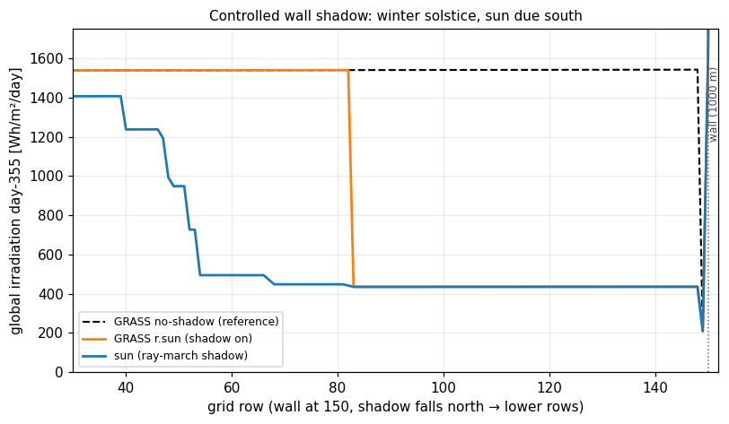

# sun — GPU-accelerated solar radiation for elevation models

Fast clear-sky solar radiation and photovoltaic (PV) potential computation
from digital elevation models (DEMs), implementing the GRASS GIS `r.sun`
model as a native Python extension with an optional WebGPU compute path.

- **Daily irradiation**: beam, diffuse, reflected, global (Wh/m²/day), and sunshine duration (h/day)
- **Annual PV potential**: kWh/m²/year for a sampled day grid, with panel efficiency
- **Full terrain physics**: cast-shadow ray-marching across the whole DEM, slope/aspect incidence, Linke turbidity, ground albedo
- **Big-raster friendly**: the array API processes row bands, so Python callers can stream rasters larger than RAM
- **GPU when available, CPU always**: measured 5–17× speedup on integrated graphics; the CPU path is rayon-parallel

## Validation at a glance

The engine is validated against GRASS GIS `r.sun` 8.3.2 on synthetic alpine
terrain and a controlled wall-shadow geometry. Full numbers, reproduction
scripts, and the two bugs the comparison exposed (both fixed) live in
[`validation/VALIDATION.md`](validation/VALIDATION.md).



Left to right: input DEM; `sun` global irradiation, day 355; GRASS `r.sun`
global irradiation, day 355; difference in Wh/m². On controlled surfaces the
radiation physics matches r.sun to better than 0.01%; residual differences
concentrate at shadow terminators.



Controlled 1000 m wall, winter solstice: in deep shadow both engines agree
exactly (435 Wh/m²/day). They differ only at the shadow edge, where `sun`
resolves partial occlusion (penumbra) that the binary horizon lookup of
r.sun cannot.

## Installation

### From PyPI

```bash
pip install sun-solar-radiation
```

Wheels are provided for Linux, macOS and Windows (CPython 3.12). The
extension has **no native dependencies** — raster I/O is done by the caller
(numpy arrays in/out), so there is no GDAL to link or install.

### From source

Requires Rust (stable, edition 2024) and Python 3.12+.

```bash
git clone https://github.com/raphi-web/sun-solar-radiation.git
cd sun-solar-radiation
pip install maturin
maturin build --release
pip install target/wheels/sun_solar_radiation-*.whl
```

To build the `sun` command-line tool (GeoTIFF in/out, needs system GDAL):

```bash
cargo build --release --features gdal-io
```

## Python API

The API is array-in/array-out: you read rasters with GDAL/rasterio/whatever
you prefer and pass flat `float32` numpy arrays. Nodata pixels must be
normalized to `-9999.0`.

### Single point

```python
import sun

result = sun.compute_pixel(
    lat_deg=47.5, elevation_m=800.0, day=172,
    slope_deg=15.0, aspect_deg=180.0,  # GRASS convention, see below
    linke=3.0, albedo=0.2,
)
print(f"Global: {result.global_rad:.0f} Wh/m²/day")
```

### Raster band (daily irradiation)

```python
import numpy as np
import sun

# elevation: flat float32 array, row-major, length ncols*nrows
# row_lat:   pixel-centre latitude per row, float32, length nrows
out = sun.compute_raster_bands(
    elevation=elev,               # np.ndarray float32, contiguous
    ncols=ncols, nrows=nrows,
    row_lat=lats,
    day=172, step=0.5,
    linke_value=3.0, albedo_value=0.2,
    dx_m=30.0, dy_m=30.0,         # pixel size in CRS units
    outputs=["glob", "insol"],
    gpu=sun.gpu_available(),      # GPU if present, else CPU
    # optional: slope=, aspect=, linke=, albedo=, mask= (flat f32 arrays)
    # optional: shadow_context_elev=, row_offset=, full_nrows= for band tiling
)
glob = out["glob"].reshape(nrows, ncols)   # Wh/m²/day, nodata = -9999
```

When `slope`/`aspect` are omitted they are derived from the elevation band
via Horn's 3×3 finite differences. **Aspect convention is GRASS**: 0° = East,
counter-clockwise (90° = North, 270° = South) — not compass.

### Tiling large rasters

The cast-shadow march spans the whole grid, so for large DEMs keep the full
elevation in memory as the shadow context and compute in row bands:

```python
for start, end in bands(nrows, band_rows=2048):
    out = sun.compute_raster_bands(
        elevation=elev_full[start:end].ravel(), ncols=ncols, nrows=end - start,
        row_lat=lats[start:end], day=172,
        shadow_context_elev=elev_full.ravel(),   # full grid
        row_offset=start, full_nrows=nrows,
        gpu=True, outputs=["glob"],
    )
    write_rows(out["glob"].reshape(end - start, ncols), start)
```

Banded results are bit-identical to a single full-grid call (enforced by the
test suite).

### Annual PV potential

```python
potential = sun.compute_annual_bands(
    elevation=elev, ncols=ncols, nrows=nrows, row_lat=lats,
    day_start=1, day_end=365, day_step=10, step=0.5,
    panel_efficiency=0.21,
    dx_m=30.0, dy_m=30.0,
    gpu=sun.gpu_available(),
)   # flat float32, kWh/m²/year, nodata = -9999
```

### Terrain helpers

```python
slope, aspect = sun.horn_slope_aspect(elev, ncols, nrows, dx_m=30.0, dy_m=30.0)
sun.gpu_available()   # bool — usable wgpu adapter present?
```

## Command line (optional, needs GDAL)

The `sun` binary reads and writes GeoTIFFs directly. Build it with
`cargo build --release --features gdal-io`.

```bash
# daily global irradiation + sunshine duration for day 172, GPU-accelerated
sun --elevation dem.tif --day 172 --glob-rad glob.tif --insol-time insol.tif --gpu

# synthetic demo DEM (100×100, Austria) when you don't have one handy
sun --create-dummy --day 172 --glob-rad glob.tif
```

Annual potential from the CLI is not wired up yet — use the Python API
(`compute_annual_bands`).

## Performance

Measured on AMD Ryzen 5 PRO 8540U (12 threads) + Radeon 740M integrated GPU,
day 172, 0.5 h step, global output:

| Grid      | Mode                     | CPU    | GPU    | Speedup |
|-----------|--------------------------|--------|--------|---------|
| 500×500   | daily                    | 0.7 s  | 0.13 s | 5.6×    |
| 500×500   | annual (37 sampled days) | 24 s   | 1.4 s  | 17×     |
| 1000×1000 | daily                    | 2.9 s  | 0.34 s | 8.8×    |
| 1000×1000 | annual (37 sampled days) | 99 s   | 6.3 s  | 16×     |
| 2000×2000 | daily                    | 12.3 s | 1.4 s  | 8.9×    |

GPU numbers will vary strongly with the adapter; a discrete GPU beats
integrated graphics by a further factor. The CPU path uses all cores.

## QGIS plugin

A ready-made QGIS plugin (dialog, layer pickers, progress bar, tiled I/O on
top of this engine) lives in the `sun_qgis-plugin` repository and ships the
same extension.

## Model

Implements the clear-sky model of GRASS GIS `r.sun`:

- Solar geometry per pixel latitude and day of year
- Cast-shadow ray-march (0.5-px DDA, bilinear DEM sampling) or precomputed horizon maps
- ESRA beam/diffuse transmittance parameterized by Linke turbidity
- Anisotropic diffuse on slopes, ground reflection via albedo

## Requirements

- Python 3.12+
- numpy (arrays in/out)
- GPU mode: any wgpu-supported backend (Vulkan/Metal/DX12); optional

## License

MIT — see LICENSE.

## Citation

Based on the r.sun model:

- Hofierka, J., Suri, M. (2002): The solar radiation model for Open source
  GIS: implementation and applications. *Open source GIS - GRASS users
  conference 2002*.
